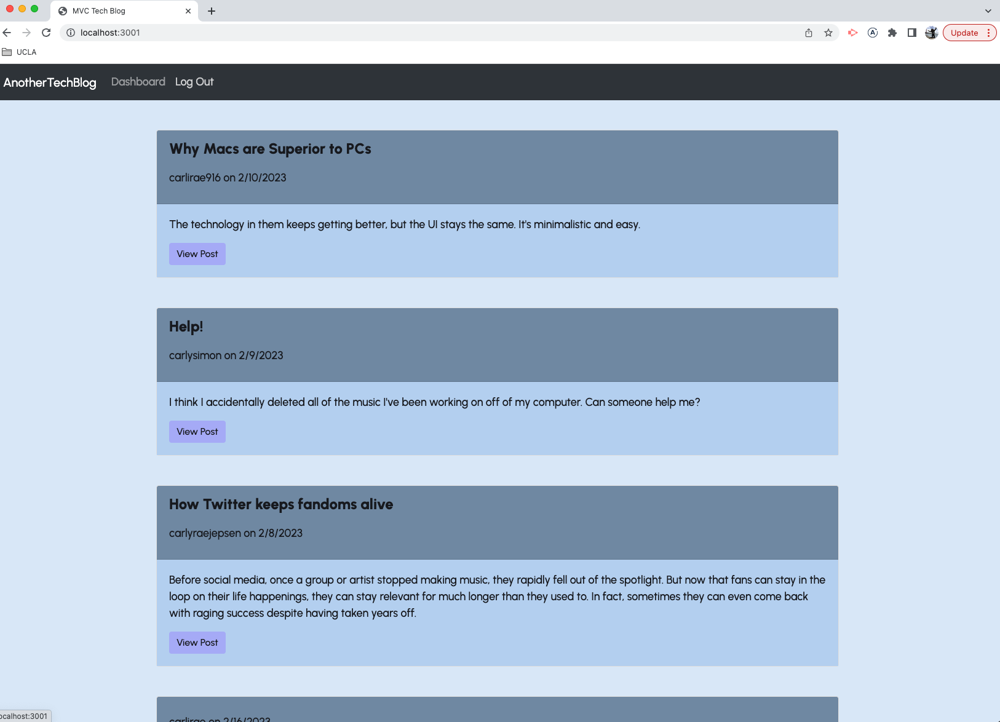

#  Challenge Fourteen - E-Commerce Back-End

  
        
  ## Description
    Week 14's assignment was to build a CMS-style blog completely from scratch, following the Model-View-Controller paradigm. Users must be able to log in and out, create, edit, and delete posts, as well as comment on others' posts. This project was done primarily with sequelize, express, and handlebars.js.
  
  ## Table of Contents
  - [Usage](#usage)
  - [Link](#link)
  - [License](#license)

  ## Usage
  This application could be used by essentially anyone, as long as they have access to a computer. This particular site is for writing about technology, but you could use this format to create a blog for any topic.

  When you go to the site, you will be taken to a homepage with all existing posts. 
  
  

  As a non-signed in user, you can view posts on the homepage, or view posts individually if you click the "View Post" button. However, if you try to comment on any post, you will be told you need to sign in. 

  

  There is a "Log In" link in the navigation panel. Click that, and you will be taken to the login page. At the bottom of the page, there's an option to create an account. Click that, and you'll be taken to the signup page. 
  
  

  Once you're logged in, you'll be taken to your dashboard. Here, you can create, edit, or delete your personal posts. Click the title at the top of the page to be taken back to the homepage. 
  
  
  
  Now, when you go to an individual post, you will be able to add a comment. as soon as you hit the "Add Comment" button, your comment will render on the page. 

  

  To log out, simply hit the "Log Out" link in the navigation bar.

  

  ## Link
  [Click this link](https://drive.google.com/file/d/1RQ0Wfp_uPMvIQ0u-MEVPCw8VSsTRMeYf/view) see a video demonstration of this application in action.
  

  ## License
    This project is covered under the ISC license. To learn more, click the badge at the top.

  ## Questions
  If you have any questions, reach out to me at https://github.com/carlihudson, or shoot me an email at carlihudson@gmail.com.
   